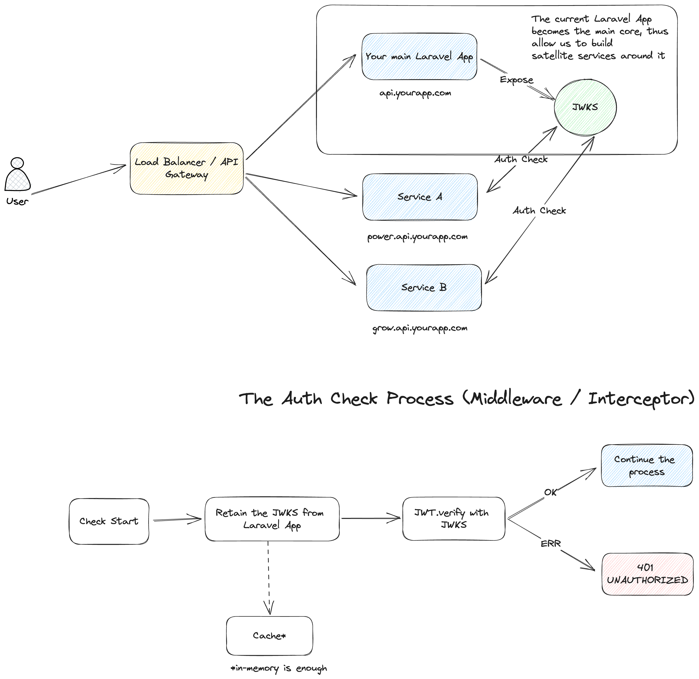

# ShipSaaS - Laravel JSON Web Key Sets (JWKS)

[](https://github.com/shipsaas/laravel-jwks/actions/workflows/build.yml)
[](https://codecov.io/gh/shipsaas/laravel-jwks)

Provide libraries to help you deal with JSON Web Key Sets (JWKS) in Laravel 😉

Documentation: [ShipSaaS Laravel JWKS](https://laravel-jwks.shipsaas.tech)

## Supports
- Laravel 10+
- PHP 8+
- **RSA** algorithm only (for now)

## Sample use cases

Ever thinking of microservices? One of the biggest challenges is having the Authentication (& Authorization) service.

However, you don't have to spend enormous time to build a brand new AuthService and migrate the current users.

Your current app = the core, the heart of everything. Let's build satellite services around that.



With (Laravel) JWKS, we will have:

- The main app exposes the JWKs internally for the satellite microservices.
- The satellite services can simply obtain the JWKs and verify the signed JWT token before handling the actual requests.

JWKS is supported in multiple languages e.g.: Node.js, Go,...

## Installation

Install the library:

```bash
composer require shipsaas/laravel-jwks
```

Export config 

```bash
php artisan vendor:publish --tag=laravel-inbox-process
php artisan migrate
```

## Documentation & Usage

Visit: [ShipSaaS Laravel JWKS](https://laravel-jwks.shipsaas.tech)

Best practices & notes are well documented too 😎!

## Testing

Run `composer test` 😆

Available Tests:

- Unit Testing
- Feature Testing with REAL KEYs

## Contributors
- Seth Phat

## Contributions & Support the Project

Feel free to submit any PR, please follow PSR-1/PSR-12 coding conventions and testing is a must.

If this package is helpful, please give it a ⭐️⭐️⭐️. Thank you!

## License
MIT License
